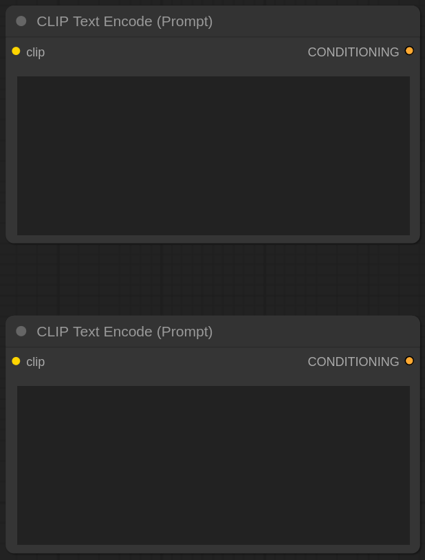
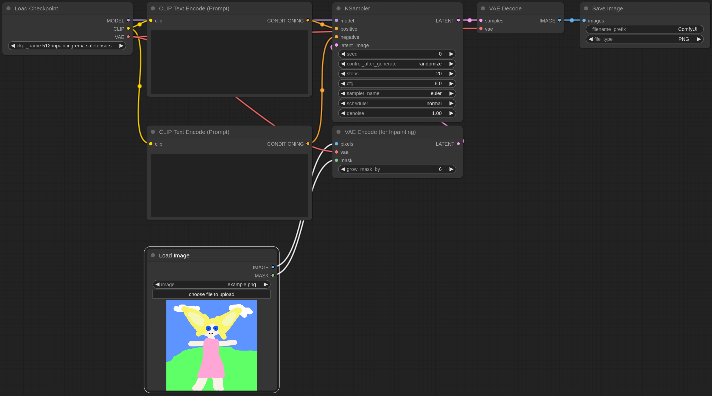

# Integrated Nodes for ComfyUI

This tool will turn entire workflows or parts of them into single integrated nodes. In a way, it is similar to the Node Templates functionality but hides the inner structure. This is useful if all you want is to reuse and quickly configure a bunch of nodes without caring how they are interconnected.

## Installation

To install, clone this repository into `ComfyUI/custom_nodes` folder with `git clone https://github.com/palant/integrated-nodes-comfyui`. Edit the example `integrated_nodes.yaml` configuration file as you see fit. After that, restart ComfyUI.

## Example nodes

The default file `integrated_nodes.yaml.example` (used as fallback if no real `integrated_nodes.yaml` file exists) contains a bunch of nodes which you might consider useful.

### Double Prompt

This combines two CLIP encoding prompts in a single node:


It is equivalent to the following workflow elements:



### ControlNet with Prompts

This combines an Apply ControlNet node with the nodes typically used with it: ControlNet loader, two text prompts and an image loader.


It is equivalent to the following workflow elements:


### txt2img

This is a complete text to image workflow in a single node:


It is equivalent to the following workflow:


### Inpaint

This is a complete image to image workflow in a single node:


It is equivalent to the following workflow:



### Inpaint not Masked

This is largely identical to the Inpaint node but inverts the image mask, so that the non-masked areas are inpainted:


It is equivalent to the following workflow:


## Adding your own integrated nodes

You can select some nodes in the workflow and click “Create Integrated Node from Selection” in the context menu. This will create a new `integrated_nodes.yaml` file if one doesn’t exist yet and add a new entry to it. The new integrated node can be used immediately.

You can add also edit `integrated_nodes.yaml` file manually, changes will only take effect after ComfyUI is restarted however. The entries in this file look like this:

```yaml
DoublePrompt:
  display_name: Double Prompt
  merge_inputs:
    clip: clip_2
  rename_outputs:
    1 CONDITIONING: positive
    2 CONDITIONING: negative
  workflow: double_prompt.json
```

You put the node’s internal name first and then list its properties indented. Supported properties are explained below.

### workflow

This is the only required property, the path to the workflow JSON file. You can provide both absolute and relative paths. The latter are resolved relative to the directory containing the `integrated_nodes.yaml` file.

The JSON file can contain either a saved workflow (in graph or API format) or an exported node template. If a node template file contains multiple templates, only the first one will be used. It is recommended to use the API format which is more reliable in case of future node changes. With current ComfyUI version, “Enable Dev mode Options” setting needs to be turned on in order to save workflows in API format.

While any workflow file should work out of the box, in some cases you may want to edit it. Any values present in the workflow’s widgets will become the new defaults for the integrated node. If you would rather keep ComfyUI’s defaults instead, remove the respective values from the `inputs` (API format) or `widget_values` (graph format) properties in the workflow file.

The order in which the widgets show up in the integrated node is determined by the node ordering in the original workflow. If you prefer to have the widgets of a different node at the top, reorder them in the workflow file. This is not recommended for exported node templates because reordering will change node IDs here, likely messing up links as a result. *Note*: Reordering nodes won’t change the fact that all optional values are always displayed at the bottom of the integrated node.

### display_name

This is the name under which the node should be displayed in ComfyUI. If omitted, the node’s internal name will be used.

Unlike the internal name, the display name can be changed freely without invalidating existing workflows.

### category

This is the category to sort the node into in ComfyUI. If omitted, the category `integrated` will be used.

### hide_inputs

By default, all inputs of the original workflow without incoming links will be present in the integrated node. If some input is optional or has a default value that should not be changed, it can be hidden via `hide_inputs` property.

For example, the following will hide the inputs `model_strength` and `sampler`:

```yaml
  hide_inputs:
  - model_strength
  - sampler
```

The same can be written on one line if desirable:

```yaml
  hide_inputs: [model_strength, sampler]
```

### merge_inputs

Inputs of the same type present on the integrated node can be merged via `merge_inputs` property. These will always have the same value then.

For example, if the original workflow contained two prompt widgets, both had a `clip` input. In the integrated mode, the second `clip` input is automatically renamed into `clip_2`. Typically however, both are supposed to receive the same CLIP model. So `clip_2` input can be merged into the `clip` input:

```yaml
  merge_inputs:
    clip: clip_2
```

It is also possible to merge more than two inputs by taking advantage of YAML’s list syntax:

```yaml
  merge_inputs:
    clip:
    - clip_2
    - clip_3
    - clip_4
```

The same can be written on one line if desirable:

```yaml
  merge_inputs:
    clip: [clip_2, clip_3, clip_4]
```

### rename_inputs

When multiple inputs of the original workflow have the same name, the names are automatically adjusted by appending numbers to them. For example, the first input named `model` will keep its name while the second will be renamed into `model_2`, the third into `model_3` and so on.

The inputs can be given more meaningful names via `rename_inputs` property, for example:

```yaml
  rename_inputs:
    model: initial_model
    model_2: refiner_model
```

### export_outputs

By default, any outputs of the original workflow not linked to anything will show up on the integrated node. This behavior might not always be desirable, if an output should show up despite being used internally as well, or if an output needs to be ignored.

The `export_outputs` allows listing explicitly which outputs should show up on the integrated node:

```yaml
  export_outputs:
  - 5 positive
  - 5 negative
```

This instructs the tool to export the outputs named `positive` and `negative` of the node with ID `5`.

*Note*: While workflow JSON files have the node ID specified explicitly in the data, exported node templates do not. Here the node ID is the index of a node in the `nodes` list, with the first node having the ID `0`.

### rename_outputs

By default, all outputs keep the name they had on the original nodes. This can be undesirable, e.g. if multiple nodes have outputs with the same name. The `rename_outputs` property allows them to be renamed:

```yaml
  rename_outputs:
    1 CONDITIONING: positive
    2 CONDITIONING: negative
```

This instructs the tool to rename the output named `CONDITIONING` on the node with ID `1` into `positive` and the output with the same name on the node with ID `2` into `negative`.

*Note*: While workflow JSON files have the node ID specified explicitly in the data, exported node templates do not. Here the node ID is the index of a node in the `nodes` list, with the first node having the ID `0`.

## Using custom nodes in integrated nodes

You can use other custom nodes in integrated nodes, but these custom nodes have to be already present when the integrated node is created. When using the default `custom_nodes` folder, you cannot control the order in which custom nodes are loaded however.

The solution is creating a different folder like `custom_nodes_last` and putting the `integrated_nodes` folder into this one. You then create an `extra_model_paths.yaml` file in the ComfyUI directory with the following contents:

```yaml
custom_nodes_last:
    custom_nodes: custom_nodes_last
```

If you already have a `extra_model_paths.yaml` file, you add this entry to the end of file. This makes sure that integrated nodes are always created last, when all the other custom nodes are already loaded.

## Caveats

This is a purely server-side approach, it has no impact on special functionality added on the client side. This means that nodes like Primitive or Reroute cannot be integrated, these have no server-side equivalents. Also, setting a default value for the `control_after_generate` widget isn’t possible.

ComfyUI’s image sizing approach appears to be flawed. As a consequence, images on nodes containing multiline text fields will appear too small and might be hidden entirely when the node is added initially.

ComfyUI currently doesn’t support multiple images on a single node. So if the Inpaint node for example contains both the input and the output image, only one of these images will be displayed at a time (whichever changed last).
